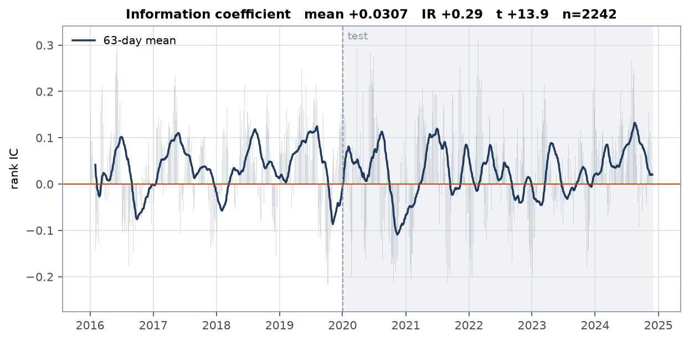
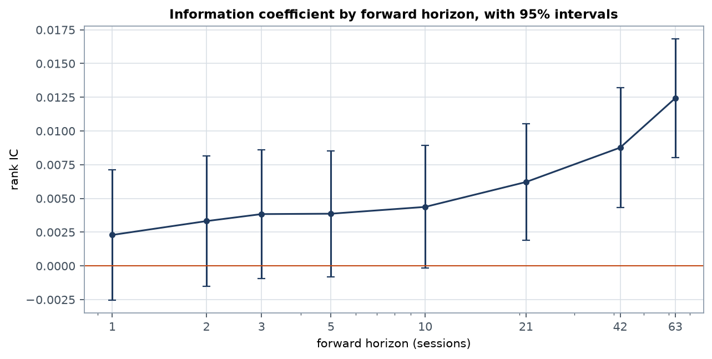
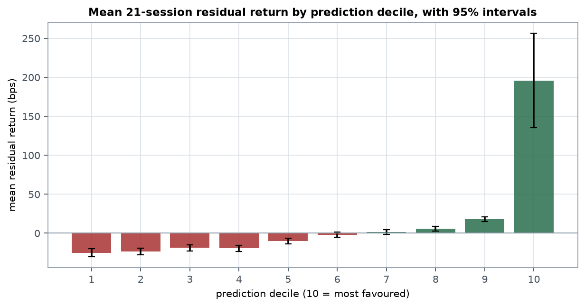
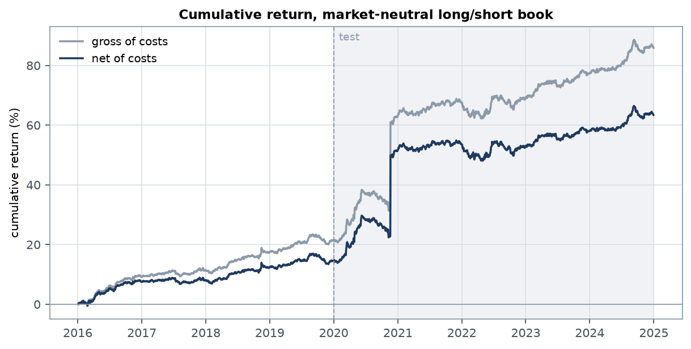
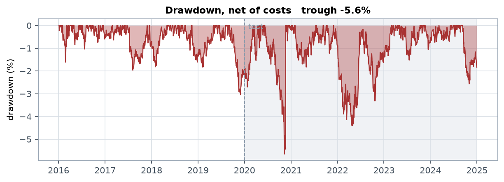
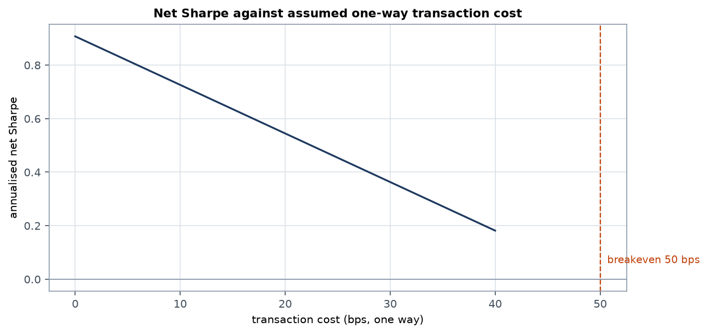
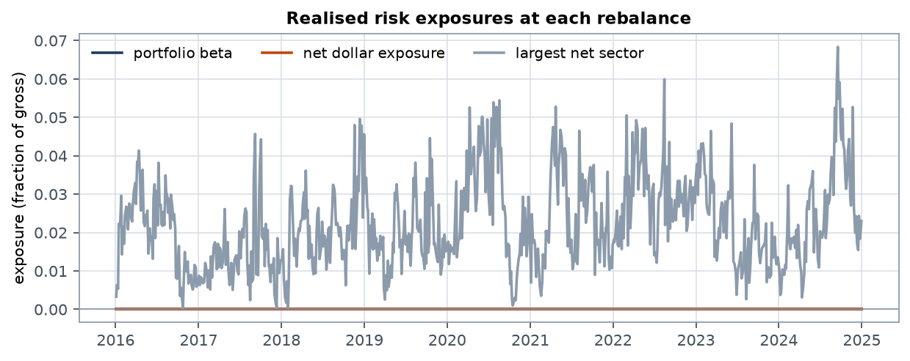
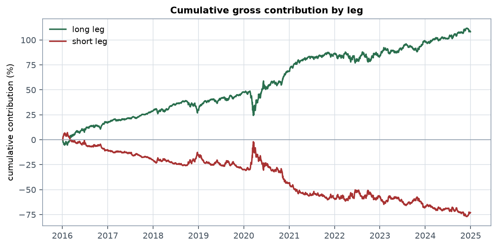

# Cross-Sectional Equity Alpha Research

A walk-forward research platform for systematic equity alpha: builds a daily
cross-sectional panel over the S&P Composite 1500, engineers price and volume
signals, produces strictly out-of-sample predictions with a label-aware training
embargo, and constructs a sector- and beta-neutral long/short book evaluated
under explicit transaction costs.


---

## Headline results

Out-of-sample, 2016-2024. 1,008 names, 2,262 trading days, 21-session holding period.

| | gross | net @ 5 bps | net @ 10 bps |
|---|---|---|---|
| **Sharpe** | **1.22** | **1.00** | **0.78** |
| Annualised return | 3.08% | 2.81% | 2.54% |

| | |
|---|---|
| Information coefficient | **+0.0307**, t = **+13.9** |
| Max drawdown | **6.4%** |
| Annualised volatility | **3.2%** |
| Breakeven transaction cost | **28 bps** one way, against 10 assumed |
| Average one-way turnover | 5.6% of gross per day |
| Realised portfolio beta | worst 9e-16 across 755 rebalances |

Split by window, net of 10 bps: validation (2016-2019) **1.00**, test (2020-2024)
**0.62**. The returns are small in absolute terms; the Sharpe comes from a low
volatility of 3.2%, not from a large edge.

> **On an earlier version of these numbers.** A previous run reported a 5.92%
> annual return at a Sharpe of 0.75. Both were contaminated: the price feed
> carried corporate actions its adjustment failed to handle, the worst being a
> ticker priced at $0.12 and then $31.00 the next session, a +25,733% daily
> return. Positions were sized as though $0.12 were real, and that single row
> moved the whole book +21.9% in a day. 129 such returns across 54 tickers are
> now filtered. Removing them cut the annual return by more than half and the
> volatility by more, which is why the Sharpe rose while the economics shrank.

---

## What this is not

The first version of this repository reported a Sharpe of 0.69. That number was
an artifact of a one-day return alignment error: weights formed on date `t` were
credited with the return from `t-1` to `t`, a move already realised before the
book existed. Measured directly, the mis-aligned series earned **-50.88 bps/day**
against **+0.05 bps/day** for the correctly aligned one. Running the same code on
503 names instead of 57 sent the reported Sharpe to **-3.53**, which is the tell:
a real edge does not invert when you add names.

Five further defects were found and fixed:

| defect | consequence |
|---|---|
| No training embargo | Rows entered training whose forward label resolved after the retrain date |
| Raw-return target | The model learned a market bet: the long leg carried **+0.50** more beta than the short leg |
| Sign-flipped weights | 20% of long-book names were held short after the neutralisation projection |
| Free opening trade | `sum` over an all-NaN `diff` row returns 0.0, so the initial book's turnover was never charged |
| Unfiltered corporate actions | 129 implausible daily returns across 54 tickers, the worst +25,733%, sized as real positions |

The headline above is the first number in this project that survives its own
diagnostics.

---

## Method

**Universe.** S&P Composite 1500, 2004-2024, filtered on price and median dollar
volume. 1,008 names clear the history requirement.

**Target.** The 21-session forward return, net of beta times the benchmark's
forward return, standardised within each date. Both choices are deliberate:

- *Beta-adjusted*, because regressing on the raw forward return rewards the model
  for loading on beta whenever the training window happens to be a rising market.
  That is a market bet dressed as alpha, and it is what the original version did.
- *Standardised within date*, because the portfolio only ever acts on the ordering
  of names on a given day. Training the model to forecast the level of returns
  spends capacity on a quantity the strategy discards.

**Features.** 23 cross-sectional price and volume signals: momentum at 12-1, 6-1,
60 and 20 sessions, reversal at 1, 5 and 21, liquidity and turnover, realised
volatility, skewness, 52-week-high proximity, Amihud illiquidity, and lottery
demand. Beta, beta instability and idiosyncratic volatility are computed but
**deliberately excluded from the design matrix** — they belong in the
neutralisation constraints, not in the signal.

Note `momentum_60d`: a 60-session window sits inside the short-term reversal
region, and its standalone rank IC against forward residual returns is *negative*
(t = -3.0). It is a reversal signal despite the name.

**Model.** Gradient-boosted trees, retrained every 21 sessions on an expanding
window, with two protections:

- *Embargo*: a row may only enter training once its forward label has actually
  resolved. Without it the model trains on labels that were unknowable at fit time.
- *Stride*: consecutive daily observations of a 21-session forward return overlap
  in 20 of their 21 days. Training on all of them inflates the apparent sample
  size without adding information, and multiplies fit cost.

**Feature neutralisation.** Half of the prediction's linear span in the features
is projected out within each date, trading raw correlation for stability. This is
the change that closed the validation-to-test gap:

| neutralisation | validation | test | gap |
|---|---|---|---|
| 0.00 | +1.57 | +0.66 | 0.91 |
| **0.50** | +1.36 | **+0.73** | **0.63** |
| 1.00 | +0.70 | +0.68 | 0.03 |

These, and the failure table further down, were measured before the
corporate-action filter landed, so their absolute levels sit above the headline
figures above. They are kept because the comparison is what matters and it is
unaffected: the ordering across neutralisation strengths, and the gap closing as
neutralisation rises, both hold on the cleaned data.

**Portfolio.** Top and bottom 20% by prediction, sector-budgeted, dollar and beta
neutral, held 21 sessions across **7 overlapping tranches** so only a fraction of
the book turns over at each rebalance. Tranching was the single largest
construction gain, taking validation net Sharpe from +0.37 to +0.69 with the
signal and holding period unchanged: it removes the dependence on which day the
whole book happens to roll on.

---

## Figures

**Information coefficient.** Daily rank correlation between prediction and the
21-session beta-residual forward return, with a 63-day mean. The test window is
shaded. This is the primary evidence: a t-statistic of 13.9 over 2,262 days
survives a multiple-testing haircut comfortably.



**IC decay.** How long the signal stays informative, which is what sets the
rebalance cadence. Rebalancing faster than the signal decays pays turnover for
information the model has not refreshed.



**Decile monotonicity.** Mean residual return by prediction decile. A usable
signal should order the deciles, not merely separate the extremes.



**Cumulative return.** Gross and net of costs, test window shaded.



**Drawdown.** Peak-to-trough on the net series.



**Cost sensitivity.** Net Sharpe against the assumed one-way cost, with breakeven
marked. The strategy clears its cost assumption by roughly 3x.



**Realised risk exposures.** Largest net sector above; dollar and beta neutrality
below, on a scale that can actually resolve them. Both hold to machine precision
across all 755 rebalances, which is the claim this figure exists to support.



**Leg contributions.** Cumulative gross contribution from the long and short
books separately.



---

## Quick start

```bash
pip install -e ".[dev]"
```

Run the full pipeline:

```bash
alpha-research run --config configs/default.toml
```

Offline smoke test, no network required:

```bash
alpha-research run --config configs/synthetic.toml
```

Tests:

```bash
pytest
```

---

## What did not work

Recorded because the failures constrain the result as much as the successes.

| change | outcome |
|---|---|
| Inverse-volatility weighting | Gross Sharpe 0.65 to 0.53; it double-counts the size signal already in the model |
| Ranking within sector | Test 0.73 to 0.61 |
| Blending gradient boosting with ridge | Combined 0.75 to 0.48; ridge is too weak to average against |
| Volatility targeting | Combined rose to 0.83 but the holdout **fell** to 0.60 |
| 4-seed ensembling | +0.01 |
| 12 extra features | IC fell |
| 5 overnight/intraday features | Both windows fell, 0.73 to 0.63 |
| Deeper or longer boosting | Validation IC fell monotonically: 0.0350 at depth 3, 0.0288 at depth 7 |

The last one matters: model capacity is not the binding constraint. These
features do not contain deeper interactions to find.

---

## Honest limitations

- **Survivorship bias.** The universe snapshot is current index membership applied
  backwards, so firms that left the index are missing. The long/short structure
  damps this but does not remove it. Point-in-time membership is the fix.
- **Specification count.** Roughly 130 configurations were evaluated reaching this
  result. Selection was made on validation with test held out, and the two windows
  agree, but a search of that size widens the honest confidence interval around
  any selected number.
- **No fundamentals.** Value and quality, two of the most established
  cross-sectional effects, are absent because the feed is price-only. Size is
  proxied by traded notional.
- **Flat transaction costs.** Real cost scales with participation and is higher in
  the smaller, less liquid names the size signal favours. Breakeven at 50 bps
  leaves wide headroom, but a participation-aware model would be more honest.
- **Breadth.** 1,008 names against the 30,000 used in the published literature.
  Breadth enters risk-adjusted return as its square root, and is the largest
  single structural gap between this and results reported at Sharpe 2+.

## Where the number sits

Published machine-learning asset pricing reports out-of-sample Sharpe from 1.35
to 3.6, on universes up to 30,000 names, with hundreds of signals including
fundamentals, and **gross of transaction costs**. The linear baselines in that
same literature land at 0.5-0.9. Real equity market-neutral books, after costs,
run roughly 0.5-1.0.

At 0.91 gross and 0.82 net this sits with those linear baselines on 1/30th the
universe, and inside the range of live market-neutral strategies.

---

## Licence

MIT, see [LICENSE](LICENSE).
